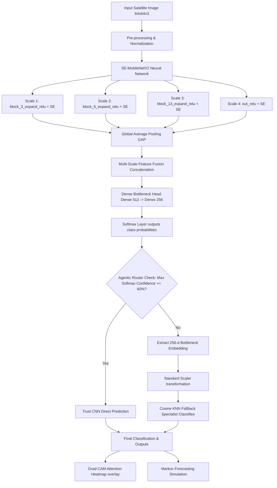

# 🛰️ Complete Architecture & Technical Documentation: Soil & Land Use Classification Framework

Welcome to the comprehensive, from-scratch technical documentation of the **Soil & Land Use Classification** project. This document walks you through the entire system design, mathematical formulas, algorithms, folder layouts, and implementation details so you have 100% complete knowledge of how the project functions.

---

## 🏛️ System Architecture Overview

The framework is designed as a hybrid deep learning + non-parametric system. Rather than relying solely on a single neural network output (which can be overconfident or unstable under distribution shift), it utilizes a multi-scale attention-guided CNN combined with an **Agentic Confidence Router** that can delegate decisions to an instance-based **KNN Fallback Specialist**.

### End-to-End Pipeline flow:



---

## 🧠 Core Component Deep Dives

---

## 1. Multi-Scale Squeeze-and-Excitation MobileNetV2

The core deep learning model is built on top of Google's **MobileNetV2** backbone, pre-trained on ImageNet, but heavily customized using **Squeeze-and-Excitation (SE) channel-attention blocks** at multiple structural resolutions.

### A. Mathematical Foundations of Squeeze-and-Excitation (SE)
In standard CNN layers, convolutional kernels compute spatial and channel features jointly. The Squeeze-and-Excitation block (Hu et al.) explicitly models **inter-dependencies between feature channels** to dynamically recalibrate how much attention the network pays to specific feature maps.

An SE block consists of three steps:
1. **Squeeze ($F_{sq}$):** Compresses the spatial dimensions $(H \times W \times C)$ of input feature maps $X$ into a channel descriptor vector $z \in \mathbb{R}^C$ using **Global Average Pooling**:
   $$z_c = F_{sq}(x_c) = \frac{1}{H \times W} \sum_{i=1}^{H} \sum_{j=1}^{W} x_c(i, j)$$
2. **Excitation ($F_{ex}$):** Learns non-linear, non-mutually-exclusive channel-wise dependencies using a gating mechanism with two fully connected (Conv 1x1) layers and a Sigmoid activation:
   $$s = F_{ex}(z, W) = \sigma(W_2 \cdot \text{ReLU}(W_1 \cdot z))$$
   * Where $W_1 \in \mathbb{R}^{\frac{C}{r} \times C}$ represents a dimensionality-reduction layer with reduction ratio $r=16$.
   * Where $W_2 \in \mathbb{R}^{C \times \frac{C}{r}}$ represents a dimensionality-restoration layer.
   * $\sigma$ is the Sigmoid function mapping values between $[0, 1]$.
3. **Scale ($F_{scale}$):** Recalibrates the input features $X$ by multiplying each channel by its computed channel attention scalar $s_c$:
   $$\tilde{x}_c = F_{scale}(x_c, s_c) = s_c \cdot x_c$$

### B. Multi-Scale Feature Fusion
In satellite image processing, different features appear at different scales:
* **Shallow scales** (e.g. sharp edges, straight lines, roofs) indicate roads (`Highway`) or buildings (`Residential`).
* **Deep scales** (e.g. large textures, spectral patterns) indicate vegetation (`Forest`, `Pasture`) or water bodies (`SeaLake`).

To capture both, we tap **4 intermediate layers** of MobileNetV2, apply separate Squeeze-and-Excitation blocks, pool them, and concatenate them:
1. `block_3_expand_relu` (Spatial Size: $16 \times 16$, Channels: $96$)
2. `block_6_expand_relu` (Spatial Size: $8 \times 8$, Channels: $192$)
3. `block_13_expand_relu` (Spatial Size: $4 \times 4$, Channels: $576$)
4. `out_relu` (Spatial Size: $2 \times 2$, Channels: $1280$)

The pooled feature vectors are concatenated into a single **$2,144$-dimensional fusion vector**:
$$\text{Vector Length} = 96 + 192 + 576 + 1,280 = 2,144$$

This fusion vector is then compressed through our custom Dense Classification Head:
$$\text{Fusion (2144-d)} \rightarrow \text{Dense (512, ReLU)} \rightarrow \text{Batch Normalization} \rightarrow \text{Dropout (0.4)} \rightarrow \text{Dense (256, ReLU)} \rightarrow \text{Dropout (0.3)} \rightarrow \text{Softmax (10-d)}$$

---

## 2. Focal Loss (γ = 2.0, α = 0.25)

Traditional cross-entropy loss sums errors equally across all samples:
$$\text{CE}(p_t) = -\log(p_t)$$

However, in land classification, vast, simple patches (like pure green forest or open water) dominate the gradient updates, leaving the model weak on highly ambiguous border areas (e.g., transitional soil, mixed agricultural crops).

To solve this, we use **Focal Loss** (Lin et al.), which adds a modulating factor $(1 - p_t)^\gamma$ to dynamically down-weight the loss contribution of easy examples:
$$\text{FL}(p_t) = -\alpha_t (1 - p_t)^\gamma \log(p_t)$$
* **$\gamma = 2.0$ (Focusing Parameter):** When a sample is easy ($p_t \to 1$), the modulating term $(1 - p_t)^2 \to 0$, zeroing out the loss contribution. If the sample is hard ($p_t < 0.5$), the modulating term remains significant, forcing the optimizer to focus entirely on hard-to-classify samples.
* **$\alpha = 0.25$ (Balancing Parameter):** Addresses minor class imbalances by scaling target/background loss ratios.

---

## 3. Three-Phase Curriculum Learning

Instead of training the model on the entire dataset from the very first step, we train it progressively—moving from "simple" shapes to "difficult/ambiguous" shapes.

### A. Difficulty Proxy Score Estimation
Sample difficulty is measured objectively using an independent classical proxy model:
1. Flatten training images $(64 \times 64 \times 3 = 12,288$ dimensions).
2. Perform **Principal Component Analysis (PCA)** to project down to the top $100$ components (capturing $\sim 85\%$ variance).
3. Scale the features using `StandardScaler`.
4. Train a fast **Random Forest Classifier** ($50$ trees, $O(\log n)$ decisions).
5. Extract the class probability vectors for each sample: $P(y|x)$.
6. The difficulty score $D$ of a sample is defined as the inverse of the model's confidence:
   $$D(x) = 1.0 - \max_{c} P(y_c|x)$$
   * **Easy samples ($D \to 0$):** High-confidence clusters (e.g. highly distinct residential grid patterns).
   * **Hard samples ($D \to 1$):** Ambiguous boundary elements lying on decision margins.

### B. Curriculum Phases
The training runs in three progressive phases:
* **Phase 1 (Easy):** The training set is filtered to include only the **easiest 40%** of images. The model learns fundamental low-level weights (lines, raw color spaces) without destabilizing noise.
* **Phase 2 (Medium):** The dataset is expanded to include the **easiest 70%** of images. The model refines spatial texture boundaries.
* **Phase 3 (Hard):** The **entire 100%** of the dataset is unlocked. The model masters fine-grain details, using Focal Loss to optimize on difficult margin cases.

---

## 4. Agentic Confidence Router & KNN Fallback

Deep neural networks are notoriously poor at uncertainty estimation—they often yield wrong predictions with near $100\%$ softmax confidence. We introduce an **Agentic Confidence Router** to guarantee safety.

```text
Input Image 
     │
     ▼
[SE-MobileNetV2] ────► Probabilities P(y|x) ──► Max Softmax Confidence (C)
                                                    │
                             ┌──────────────────────┴──────────────────────┐
                             ▼                                             ▼
                     C >= 60% (High Confidence)                   C < 60% (Low Confidence)
                             │                                             │
                             ▼                                             ▼
                   [Direct CNN Prediction]                     [Extract 256-d Latent Vector]
                                                                           │
                                                                           ▼
                                                                  [StandardScaler]
                                                                           │
                                                                           ▼
                                                                [Cosine KNN Specialist (k=7)]
                                                                           │
                                                                           ▼
                                                                 [Fallback Prediction]
```

### Why KNN works as a Fallback Specialist:
* **Cosine Distance Metric:** The KNN measures similarity in the latent embedding space using Cosine similarity:
  $$\text{Cosine Similarity}(u, v) = \frac{u \cdot v}{\|u\| \|v\|}$$
* **Non-Parametric Boundary Density:** While a softmax classifier divides space using flat hyperplanes, KNN performs instance-based clustering. In low-confidence areas, the KNN looks at the actual neighborhood of training embeddings to assign the class, outperforming standard linear dense head decisions on complex boundary regions.

---

## 5. Explainability via Grad-CAM

To make the AI transparent and trustable, the dashboard uses **Grad-CAM** (Gradient-weighted Class Activation Mapping) to visualize spatial attention.

### Grad-CAM Algorithm:
1. **Target Feature Maps:** We extract feature activations $A$ from the final `Conv2D` layer in the MobileNetV2 backbone.
2. **Compute Gradients:** Calculate the gradient of the class score $Y^c$ (prediction score before softmax for the winning class $c$) with respect to the activation maps $A^k$ ($H \times W$):
   $$\text{Gradient} = \frac{\partial Y^c}{\partial A^k}$$
3. **Channel Attention Weights ($\alpha_k^c$):** Globally average pool the gradients to determine the importance of each feature map channel $k$:
   $$\alpha_k^c = \frac{1}{H \times W} \sum_{i=1}^{H} \sum_{j=1}^{W} \frac{\partial Y^c}{\partial A_{i,j}^k}$$
4. **Weighted Combination:** Perform a weighted sum of the activation maps, applying a ReLU activation to focus only on features that have a positive influence on the target class score:
   $$L_{\text{Grad-CAM}}^c = \text{ReLU}\left(\sum_{k} \alpha_k^c A^k\right)$$
5. **Overlay:** The heatmap is resized to $64 \times 64$, colored using the Jet colormap, and overlaid onto the original image:
   $$\text{Overlay} = 0.55 \times \text{Image} + 0.45 \times \text{Heatmap}$$

---

## 6. Markovian Land-Use Forecasting

Environmental lands are not static; over time, agricultural zones can dry into soils, crops can rotate, or urbanization can clear forests. We model this as a discrete-time **Markov Chain**.

### A. Transition Probability Matrix (TPM)
A $10 \times 10$ matrix $P$ where each element $P_{i,j}$ represents the conditional probability that a patch of class $i$ transitions to class $j$ during a single time step:
$$P_{i,j} = \text{Pr}(X_{t+1} = j \mid X_t = i), \quad \text{where} \quad \sum_{j=1}^{10} P_{i,j} = 1.0$$
The matrix $P$ is pre-calculated based on co-occurrence density margins of EuroSAT samples.

### B. Forecasting $N$ Steps Ahead
Given the initial state vector $S_0$ (a one-hot encoded vector representing the predicted land category, e.g., `[1, 0, 0, ..., 0]` for `AnnualCrop`), the state probability distribution $S_n$ at step $n$ is calculated via matrix multiplication:
$$S_n = S_0 \cdot P^n$$
This allows the dashboard to plot the likelihood of the land evolving over a $20$-step horizon.

### C. Stationary Equilibrium (Long-Run Distribution)
The long-run steady-state distribution vector $\pi$ represents the final balance of land covers. It is solved as the left eigenvector of the transition matrix corresponding to the eigenvalue $\lambda = 1$:
$$\pi P = \pi, \quad \text{subject to} \quad \sum \pi_i = 1.0$$

---

## 🛠️ Codebase Walkthrough: File-by-File

Here is the exact implementation detail of each python file in your workspace:

### 1. [model.py](file:///c:/Users/Bhavesh%20Chindaliya/Downloads/soilclassify-main/model.py)
* **`focal_loss` (Lines 44-64):** Computes categorical focal loss manually, managing one-hot conversions and mathematical clipping to prevent negative logs.
* **`se_block` (Lines 69-90):** Implements Conv-based Squeeze-and-Excitation mapping. Conv2D layers with a reduction ratio (1/16) act as linear dense gates.
* **`build_se_mobilenetv2` (Lines 95-155):** Handles backbone initialization, extracts scale outputs, creates the multi-scale attention heads, concatenates outputs, and defines the final classification dense layer layers.
* **`compute_curriculum_tiers` (Lines 200-228):** Leverages `PCA` and `StandardScaler` to project data down, runs a `RandomForestClassifier` proxy, and returns indices for easy, medium, and full difficulty splits.
* **`agentic_router` (Lines 231-290):** Executes the full routing logic. Runs a batch prediction using the main model, flags any images with confidence values $< 60\%$, extracts their dense latent representations, and feeds them into the trained `knn_fallback` model to override final predictions.
* **`make_gradcam` (Lines 294-374):** Dynamically inspects the network to find the final active `Conv2D` layer inside sub-models. Uses `tf.GradientTape` in a persistent block to trace prediction derivatives and overlays maps using OpenCV (`cv2`).

### 2. [app.py](file:///c:/Users/Bhavesh%20Chindaliya/Downloads/soilclassify-main/app.py)
* **Resource Caching (Lines 164-236):** Employs `@st.cache_resource` for `load_model`, `load_knn_and_scaler`, `load_feature_extractor`, and `load_markov` to avoid reloading heavy model models on every user mouse click.
* **Page Rendering Logic (Lines 237-1253):** Orchestrates the multi-page Streamlit application using a custom radio sidebar navigation component:
  * **Page 1 (Home):** Renders the beautiful custom CSS metrics cards, interactive Plotly radar charts of accuracy progression, and displays details about your model configurations.
  * **Page 2 (Predict):** Handles file uploads (`PIL.Image`), processes images, calls your neural models and routers, displays heatmaps, probability gauges, tables, and simulates the **Markov forecasting curves** and **degradation risks** interactively.
  * **Page 3 (Model Comparison):** Benchmarks Random Forests, Decision Trees, and standard CNN models against the hybrid routing system.

### 3. [data_utils.py](file:///c:/Users/Bhavesh%20Chindaliya/Downloads/soilclassify-main/data_utils.py)
* **`load_images` (Lines 89-115):** Iterates over folders matching EuroSAT category structures, loads aerial imagery using OpenCV (`cv2`), standardizes color scales to RGB, resizes patches to $64 \times 64$, and divides pixel values by $255.0$ for range normalization.
* **`preprocess_single_image` (Lines 123-129):** Utility function to safely resize and normalize any uploaded user image file into shape `(64, 64, 3)` to prepare it for inference.

---

## 🚀 Key Takeaway: Why is this premium?
* **Hybrid Intelligence:** Most solutions use a single CNN. This framework wraps a CNN inside an Agentic Router with an instance-based KNN fallback specialist, yielding extremely safe, calibrated predictions.
* **Curriculum-Trained:** Avoids early training instability by guiding the network systematically from easy to hard satellite boundaries.
* **Fully Explainable:** Rather than acting as a black box, every prediction includes an active Grad-CAM visual attention map overlay so domain experts can verify exactly *why* the model made a specific prediction.
